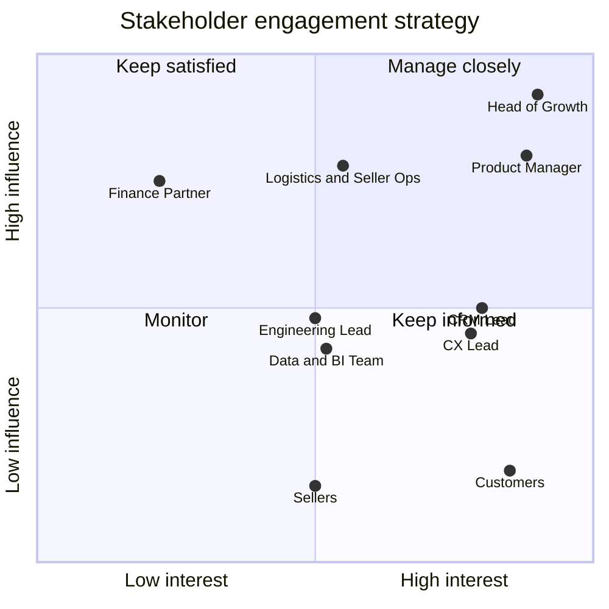

# 01. Stakeholder Map & Problem Statement

> **Note on framing:** This is a simulated engagement built on the public Olist dataset. The company
> context and stakeholder roles below are fictional and exist to practise the business analysis
> workflow. All data figures come from the real dataset.

## Problem statement

Olist's marketplace acquires customers successfully, but almost none of them come back.
In the loaded dataset, **only 3.12% of customers (2,997 of 96,096) placed a second order**
(first-pass figure across all order statuses; refined in Phase 2).

Growth that depends on constantly buying new customers is expensive and fragile. The Head of Growth
has asked the product team to find out **why repeat purchasing is so low and what to build to
improve it**.

## Stakeholders

| # | Stakeholder (fictional role) | Interest in this project | Influence | Interest | What they need from the BA |
|---|---|---|---|---|---|
| 1 | **Head of Growth** (sponsor) | Owns the retention goal and the budget | High | High | Clear diagnosis, ranked recommendations, expected revenue impact |
| 2 | **Product Manager, Post-Purchase Experience** | Will own the features that come out of this | High | High | Requirements, user stories, a prioritized backlog, PRD |
| 3 | **Head of Logistics & Seller Operations** | Delivery performance is a likely churn driver | High | Medium | Evidence on where delays occur, without blame; realistic asks of sellers and carriers |
| 4 | **CRM / Marketing Lead** | Runs coupons, email and re-engagement campaigns | Medium | High | Segments to target, timing of outreach, test design |
| 5 | **Customer Experience Lead** | Owns review scores and complaints | Medium | High | Link between experience and repeat behaviour |
| 6 | **Finance Partner** | Approves spend, cares about unit economics | High | Low | Revenue at risk and ROI assumptions stated explicitly |
| 7 | **Engineering Lead** | Builds and maintains any new features | Medium | Medium | Feasibility questions early, unambiguous acceptance criteria |
| 8 | **Data / BI Team** | Owns data definitions and dashboards | Medium | Medium | Agreed KPI definitions, reproducible SQL, data quality notes |
| 9 | **Sellers (external)** | Affected by any delivery or review-related change | Low | Medium | Not engaged directly; represented by Logistics & Seller Ops |
| 10 | **Customers (external)** | End users of every feature proposed | Low | High | Represented through review and behaviour data |

## Power / interest grid

## Engagement plan

| Group | Approach | Cadence |
|---|---|---|
| Manage closely (Growth, Product) | Working sessions, review drafts before wider circulation | Weekly |
| Keep satisfied (Finance, Logistics) | Pre-read the impact assumptions, no surprises at readout | At milestones |
| Keep informed (CRM, CX, Eng, Data) | Shared docs, short demos of findings | Bi-weekly |
| Monitor (Sellers, Customers) | Represented through data and via Logistics and CX | As needed |

## RACI for project deliverables

R = Responsible, A = Accountable, C = Consulted, I = Informed

| Deliverable | BA | Head of Growth | Product Mgr | Logistics | CRM | CX | Finance | Eng | Data/BI |
|---|---|---|---|---|---|---|---|---|---|
| Business Requirements Document | R | A | C | C | C | C | C | I | C |
| KPI definitions | R | A | C | C | C | C | C | I | C |
| Retention and funnel analysis | R | I | C | C | C | C | I | I | A |
| Feature recommendations | R | C | A | C | C | C | C | C | I |
| RICE roadmap | R | C | A | C | C | C | C | C | I |
| A/B test plan | R | I | A | I | C | C | I | C | C |
| PRD (top feature) | C | I | A/R | C | C | C | I | C | I |

## Open questions for stakeholders

1. Is repeat purchase within 90 days the right retention definition, or does the business expect longer buying cycles (for example furniture versus beauty)?
2. Is there a margin target Finance uses to judge a retention incentive (coupon cost versus lifetime value)?
3. Can Logistics change carrier promises (estimated delivery dates), or only monitor them?
4. Are there existing retention programmes that this work must not overlap with?
