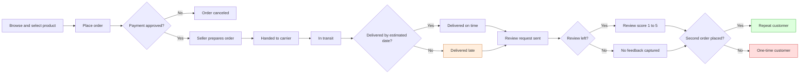
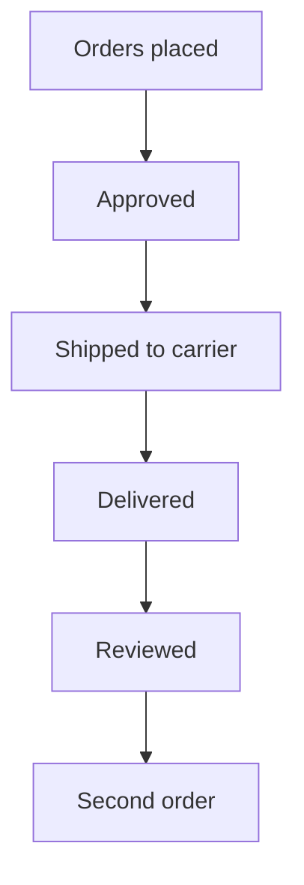
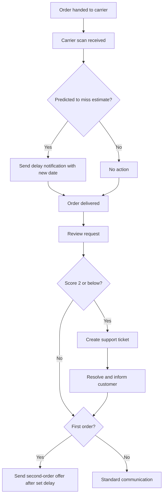
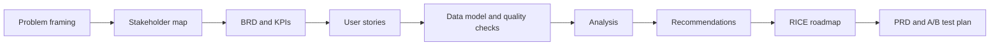

# 04. Process Flows

Diagrams are written in Mermaid and render directly on GitHub.

## 1. Customer journey (current state)

The journey from browsing to a possible second purchase, with the data captured at each step
and the point where the dataset lets us observe drop-off.

### Where each step is measured

| Step | Source column (`dw.fact_orders`) |
|---|---|
| Place order | `purchase_ts`, `order_status` |
| Payment approved | `approved_ts` |
| Handed to carrier | `carrier_ts` |
| Delivered | `delivered_ts`, `delivery_days` |
| On time or late | `is_late`, `delay_days` |
| Review | `review_score` |
| Second order | `customer_order_seq`, `cohort_month` |

## 2. Funnel stages analysed in Phase 2

The funnel query counts orders reaching each stage and the conversion between stages.
The largest expected drop is the last step, which is the subject of this project.

## 3. Proposed future state: proactive delay handling

Supports US-05 (delay notification) and US-08 (review follow-up).

## 4. Requirements process followed in this project

## Notes and limitations

- The future-state flow is a proposal. No part of it is validated until the A/B test is run.
- The dataset has no browse or cart events, so the journey is observable only from order placement onward.
- Delay prediction (the decision in the future-state flow) is out of scope for the analysis; the flow
  shows where such a capability would sit.
