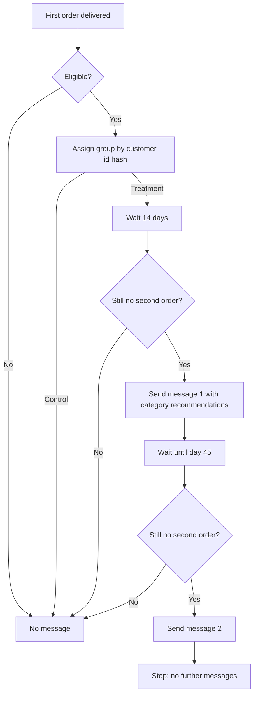

# 06. PRD: Second-Order Nudge

| | |
|---|---|
| **Status** | Draft for review (simulated engagement; roles are fictional) |
| **Owner** | Product Manager, Post-Purchase Experience |
| **Author** | Business Analyst |
| **Roadmap item** | F1 in `roadmap/01_roadmap.md` (RICE 3,491, rank 1) |
| **Related** | US-07, BR-07, `roadmap/02_ab_test_plan.md` |
| **Effort estimate** | About 2 person-months (assumption, to be confirmed by Engineering) |

## 1. Overview

After a customer's first order is delivered, send a timed message that suggests relevant products based on
what they bought, to raise the share of customers who place a second order.

## 2. Problem and evidence

Only 3.0% of customers ever place a second delivered order, and 1.23% do so within 90 days
(`docs/05_findings.md`). Three findings shape this feature:

| Evidence | Design consequence |
|---|---|
| Return activity is highest in month 1 (0.45%) and falls to about 0.2% from month 4 | Message early: days 14 and 45 after delivery |
| Repeat rate differs by category, from 0.80% (computers_accessories) to 1.75% (bed_bath_table) | Choose recommendations by the first order's category |
| Customers with a 1 to 2 star first review return less (0.98% vs 1.29% for 4 to 5 stars) | Do not send promotions to unhappy customers; route them to service recovery |

These are associations from observational data. The A/B test is what tests whether the message itself
changes behaviour.

## 3. Goals and non-goals

**Goals**
1. Increase the 90-day repeat rate of first-time customers. The test is designed to detect +0.5 points
   (from 1.23% to 1.73%), about 70 extra returning customers per quarter at current volume.
2. Do it at very low marginal cost, with no discount in the first version.
3. Keep complaint and unsubscribe rates within agreed limits.

**Non-goals**
- Discounts or loyalty programmes (later test, needs Finance input)
- Delay notifications and review follow-up (roadmap items F2 and F3)
- Personalized recommendation models; version 1 uses simple category rules
- Targeting customers who have already returned

## 4. Users

| User | Need |
|---|---|
| First-time customer | A relevant, non-intrusive reminder that is easy to ignore or opt out of |
| CRM lead | Control over content, timing and frequency without an engineering release |
| Product manager | A clean experiment and trustworthy results |
| Data/BI analyst | Events to measure exposure and outcome |

## 5. Proposed flow

**Eligibility:** consented contact, first-time customer, first review not 1 to 2 stars (or no review), no
second order yet.

## 6. Functional requirements

| ID | Requirement | Priority |
|---|---|---|
| FR-01 | The system shall detect delivery of a customer's first order and evaluate eligibility | Must |
| FR-02 | The system shall exclude customers who opted out, lack contact consent, or left a 1 to 2 star review | Must |
| FR-03 | The system shall assign eligible customers to treatment or control by a stable hash of `customer_unique_id`, 50/50 | Must |
| FR-04 | The system shall send message 1 on day 14 and message 2 on day 45 after delivery, only if no second order has been placed | Must |
| FR-05 | The system shall choose recommended categories from a configurable mapping keyed on the first order's category | Must |
| FR-06 | The system shall cap messages at two per customer in this programme and never send after a second order | Must |
| FR-07 | Every message shall include a working opt-out | Must |
| FR-08 | The system shall log events: assigned, eligible-but-excluded (with reason), sent, delivered, opened, clicked | Must |
| FR-09 | The CRM lead shall be able to edit message content and the category mapping without a code release | Should |
| FR-10 | A kill switch shall stop all sends immediately | Must |
| FR-11 | Orders shall be attributed to the programme when placed within the 90-day window, for reporting | Should |

## 7. Non-functional requirements

- **Privacy and consent:** comply with Brazil's data protection law (LGPD); send only to customers with valid
  consent; honour opt-outs immediately.
- **Reliability:** sends are idempotent, so a retry never double-sends.
- **Performance:** daily batch is sufficient; no real-time requirement.
- **Auditability:** assignment and exclusion reasons are stored so the experiment can be reproduced.

## 8. Content rules (version 1)

- Recommend categories related to the first purchase; do not re-offer the same item.
- No price promises or discounts.
- Candidate categories to start with, from Phase 2, are those with above-average repeat rates
  (for example bed_bath_table, sports_leisure, furniture_decor). **These are starting points, not proven
  winners:** category is tangled up with price, sellers and region.
- Copy is written in Portuguese and reviewed by the CRM lead.

## 9. Success metrics

As defined in `roadmap/02_ab_test_plan.md`.

| Type | Metric |
|---|---|
| Primary | 90-day repeat rate, treatment versus control |
| Secondary | 30-day repeat rate; revenue per customer at 90 days; value of the second order |
| Guardrails | Unsubscribe and complaint rate; second-order review score; contact-centre volume |

## 10. Rollout

| Phase | What happens | Exit criterion |
|---|---|---|
| 0. Instrumentation | Events, consent check, experiment flag in reporting | Dry run shows correct assignment and logging |
| 1. A/B test | 50/50 across all eligible customers | Sample ratio check passes; read-out per the decision rule |
| 2. Ramp | Roll out to all eligible customers if the decision is ship | Guardrails stay green |
| 3. Iterate | Timing and content tests, then an incentive arm | Finance approves cost per returning customer |

## 11. Dependencies

- Customer contact and consent data (owner: CRM / Data)
- A messaging channel and template tooling (owner: CRM)
- Experiment assignment and logging (owner: Engineering / Data)
- Finance input on acceptable cost, before any incentive is tested

## 12. Risks

| Risk | Likelihood | Impact | Mitigation |
|---|---|---|---|
| Message has no effect | Medium | Low (cheap to run, and a clear answer) | Stop per the decision rule |
| Complaints or unsubscribes rise | Low | Medium | Two-message cap; guardrail with a kill switch |
| Many customers lack usable consent | Medium | High | Measure eligible volume first; it may set the sample size |
| Test runs too long at current volume | High | Medium | Design for +0.5 points; accept an inconclusive result per the decision rule |
| Finding reflects category mix, not the message | Medium | Medium | Randomize; check balance on category |

## 13. Open questions

1. What share of customers have usable contact and consent? This sets the real sample size.
2. Is there an existing CRM programme this must not overlap with?
3. What cost per returning customer would Finance accept for a later incentive test?
4. Do same-day second orders come from split multi-seller carts (roadmap item F4)? If so, how should they be
   counted in the primary metric?

## 14. Acceptance criteria

Drawn from US-07 and the requirements above.

- **Given** a first order marked delivered and an eligible customer in the treatment group, **when** 14 days
  have passed with no second order, **then** message 1 is sent and the send is logged.
- **Given** a customer left a 1 to 2 star review, **when** eligibility is evaluated, **then** no promotional
  message is sent and the exclusion reason is logged.
- **Given** a customer places a second order after message 1, **when** day 45 arrives, **then** message 2 is
  not sent.
- **Given** a customer opts out, **when** the next send is due, **then** nothing is sent.
- **Given** the programme is enabled, **when** I query assignments, **then** the split between groups is
  within the expected range of 50/50.
- **Given** the kill switch is turned on, **when** the next batch runs, **then** no messages are sent.
